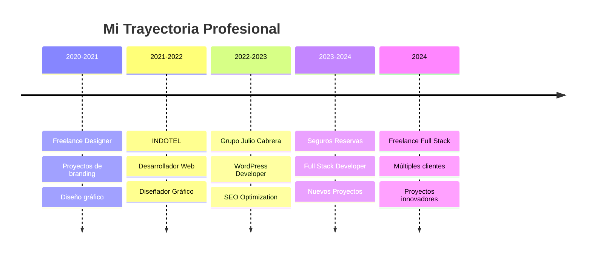
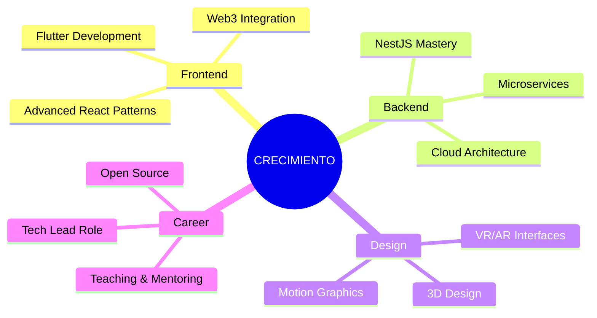

<div align="center">

# 🚀 **ALEXIS GUILLEN**

## <sub>_PORTFOLIO PERSONAL_</sub>

<h3>
  
</h3>

<div style="margin: 20px 0;">

<a href="https://www.linkedin.com/in/alexiisart/" target="_blank">
  
</a>
<a href="https://www.behance.net/alexiisguillen1" target="_blank">
  
</a>
<a href="https://alexiisportfolio.netlify.app/" target="_blank">
  
</a>
<a href="mailto:pedroalexiis009@gmail.com" target="_blank">
  
</a>

</div>


---

</div>

##  **SOBRE MÍ**

```typescript
const alexis: Developer = {
  name: "Alexis Guillen",
  role: "Full Stack Developer & Visual Artist",
  location: "República Dominicana 🇩🇴",

  languages: ["JavaScript", "TypeScript", "C#", "HTML", "CSS"],
  frameworks: ["Angular", "React", ".NET Core", "Node.js"],
  databases: ["SQL Server", "Firebase"],
  tools: ["Git", "Azure DevOps", "Adobe Creative Suite"],

  currentlyLearning: ["Flutter", "NestJS", ".NET Core 9"],
  passion: "Crear experiencias digitales excepcionales",

  workingOn: ["OpenIIS UI Library", "Checkliist App", "Client Projects"],
  collaboration: "Siempre abierto a nuevos proyectos innovadores",
};
```

<details>
<summary><strong>🎯 Mi Filosofía de Desarrollo</strong></summary>
<br>

> 🌟 **"Combino la precisión técnica del desarrollo con la creatividad del diseño para crear soluciones que no solo funcionen perfectamente, sino que también inspire y emocionen a los usuarios."**

- 💡 **Innovación Constante**: Siempre buscando las últimas tecnologías y tendencias
- 🎨 **Diseño Centrado en el Usuario**: Cada línea de código tiene propósito y elegancia
- 🚀 **Calidad Premium**: Desde el concepto hasta la implementación, sin compromisos
- 🤝 **Colaboración Efectiva**: Trabajo en equipo y comunicación transparente

</details>

---

##  **STACK TECNOLÓGICO**

<div align="center">

### 🎨 **Frontend Development**


### ⚙️ **Backend Development**


### 🗄️ **Database & Cloud**


### 🎨 **Design & Creative**


### 🛠️ **Tools & DevOps**


</div>

---

##  **PROYECTOS DESTACADOS**

<table>
<tr>
<td width="50%">

### 🌟 **Mi Portafolio Personal**

[]()
[]()

**🚀 Descripción**: Portfolio personal con diseño moderno y animaciones suaves

**✨ Características**:

- ⚡ Diseño responsive
- 🎨 Animaciones CSS avanzadas
- 📱 UX optimizada
- 🌙 Modo oscuro/claro

**🔗 [Ver Demo](https://alexiisportfolio.netlify.app/)**

</td>
<td width="50%">

### 🏛️ **Valida Firma - INDOTEL**

[]()
[]()

**🎯 Descripción**: Manual de identidad visual para proyecto gubernamental

**✨ Características**:

- 📋 Manual completo de brand
- 🎨 Identidad corporativa
- 📐 Guías de uso
- 🏆 Proyecto oficial INDOTEL

**🔗 [Ver en Behance](https://www.behance.net/gallery/204811741/Validafirma-Branding)**

</td>
</tr>

<tr>
<td width="50%">

### 💰 **Renta Vitalicia**

[]()
[]()

**💼 Descripción**: Plataforma empresarial para cálculo de seguros

**✨ Características**:

- 📊 Cálculos actuariales
- 📈 Reportes dinámicos
- 🔐 Sistema seguro
- 💾 Gestión de pólizas

**🏢 Proyecto Interno - Seguros Reservas**

</td>
<td width="50%">

### ✅ **Checkliist App**
[]()
[]()
[]()

**📝 Descripción**: App moderna para gestión de tareas

**✨ Características**:

- ✅ CRUD completo
- 💾 Persistencia local
- 📱 Diseño responsive
- 🎨 UI intuitiva

**🔗 [Ver en App en vivo](https://tinyurl.com/ypnmkfq5)**

</td>
</tr>

<tr>
<td colspan="2">

### 🎨 **OpenIIS UI Library**

[]()
[]()
[]()

**🧩 Descripción**: Biblioteca completa de componentes UI reutilizables para Angular

**✨ Características**:

- 🧱 +20 componentes modulares
- 📚 Documentación completa con README
- 🎨 Temas personalizables
- ♿ Accesibilidad integrada
- 📖 Ejemplos interactivos

**🔗 [Ver en App en vivo](https://ui.openiis.org/home)**

</td>
</tr>
</table>

---

## 💼 **EXPERIENCIA PROFESIONAL**

<div align="center">



</div>

### 💼 **Desarrollador Full Stack**

<details>
<summary><strong>🏢 Seguros Reservas</strong> - <em>Desarrollador de Nuevos Proyectos</em></summary>

**📅 Período**: 2023 - 2024  
**🎯 Logros**:

- 🚀 Desarrollo de plataforma de seguros vitalicios
- 📊 Sistema de intermediarios de seguros
- 💹 Implementación de cálculos actuariales
- 🔧 Optimización de procesos empresariales

**💻 Tecnologías**: Angular, .NET Core, SQL Server, Azure DevOps

</details>

<details>
<summary><strong>🏛️ INDOTEL</strong> - <em>Desarrollador Web</em></summary>

**📅 Período**: 2021 - 2022  
**🎯 Logros**:

- 🌐 Desarrollo de componentes web institucionales
- 🎨 Creación de identidad visual ValidaFirma
- 📱 Interfaces responsive y accesibles
- 🤝 Colaboración con equipos gubernamentales

**💻 Tecnologías**: HTML, CSS, JavaScript, Adobe Creative Suite

</details>

### 🎨 **Artista Visual & Diseñador**

<details>
<summary><strong>🎯 Proyectos Destacados de Diseño</strong></summary>

**🏆 Clientes Principales**:

- 🏛️ **INDOTEL** - Manual de identidad ValidaFirma
- 🏢 **Alcaldía de San Pedro de Macorís** - Branding institucional
- 🛋️ **Grupo Julio Cabrera** - Identidad corporativa mueblería
- 🏥 **Sultana Medical Center** - Material promocional
- 🛍️ **Shopping Time** - Branding retail

**🎨 Especialidades**:

- 📐 Diseño de logotipos e identidad corporativa
- 🖼️ Retoque fotográfico y composición digital
- 🎬 Motion graphics y animaciones
- 📱 Diseño de interfaces UI/UX

</details>

---

## 🎓 **EDUCACIÓN & CERTIFICACIONES**

<div align="center">

### 🎓 **FORMACIÓN ACADÉMICA**

**Ingeniería en Sistemas de la Información**  
_Universidad Nacional Tecnológica (UNNATEC)_

</div>

<table>
<tr>
<td width="50%">

### 🏆 **CERTIFICACIONES EN DESARROLLO**

 **Master en Fullstack Web Programming**  
_Udemy Academy_

 **Certificación Angular & ASP.NET Core 9**  
_Udemy Academy_

 **Desarrollo Web HTML & CSS**  
_Instituto de Economía Internacional_

 **Inteligencia Artificial y Productividad**  
_Google/Santander Open Academy_

 **Gestión de Proyectos**  
_Santander Open Academy_

</td>
<td width="50%">

### 🎨 **CERTIFICACIONES EN DISEÑO**

 **Técnico Superior en Diseño Gráfico**  
_Centro de Tecnología Universal (CENTU)_

 **Diplomado en Diseño Gráfico**  
_Edutin Academy_

 **Diseño y Creación de Logotipos**  
_Domestika_

 **Retoque Fotográfico Avanzado**  
_Domestika_

 **Marketing Digital**  
_Google/The Open University_

</td>
</tr>
</table>

---

## ⚙️ **METODOLOGÍAS & PROCESOS**

<div align="center">

| **Metodologías Ágiles**                                                                                  | **Control de Versiones**                                                                                              | **CI/CD**                                                                                                         | **Testing**                                                                                                                    |
| -------------------------------------------------------------------------------------------------------- | --------------------------------------------------------------------------------------------------------------------- | ----------------------------------------------------------------------------------------------------------------- | ------------------------------------------------------------------------------------------------------------------------------ |
|  |                             |  |                        |
|         |  |             |  |

</div>

### 🔄 **Mi Proceso de Desarrollo**

```
🎯 ANÁLISIS → 📐 DISEÑO → 💻 DESARROLLO → 🧪 TESTING → 🚀 DEPLOY → 📊 MONITOREO
```

---

##  **OBJETIVOS 2024-2025**

<div align="center">

### 🎯 **ROADMAP PROFESIONAL**



</div>

- 🚀 **Flutter**: Desarrollo de aplicaciones móviles híbridas
- 🔧 **NestJS**: Profundización en arquitecturas backend escalables
- 🎨 **Motion Graphics**: Exploración de nuevas tendencias visuales
- 📱 **Mobile First**: Enfoque completo en experiencias móviles
- 🌟 **Open Source**: Contribuciones activas a la comunidad
- 👨‍🏫 **Mentoring**: Compartir conocimiento con nuevos desarrolladores

---

<div align="center">

##  **CONECTA CONMIGO**

<div align="center" style="margin: 30px 0;">

<a href="https://www.linkedin.com/in/alexiisart/" target="_blank">
  
</a>
<a href="https://www.behance.net/alexiisguillen1" target="_blank">
  
</a>
<a href="https://alexiisportfolio.netlify.app/" target="_blank">
  
</a>
<a href="mailto:pedroalexiis009@gmail.com" target="_blank">
  
</a>

</div>

### 💬 **"Siempre abierto a nuevos desafíos y colaboraciones innovadoras"**

---

### ⚡ **Gracias por visitar mi portfolio**

_Combinando creatividad y tecnología para crear experiencias excepcionales_

**© 2024 Alexis Guillen · Desarrollador Full Stack & Artista Visual**

</div>
